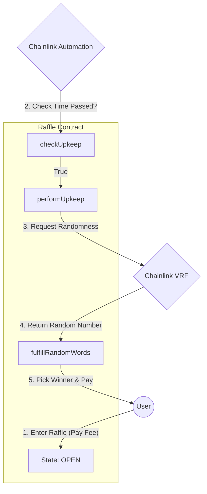

<div align="center">
  

  <br/>

  <p>
    <a href="https://github.com/NexTechArchitect/Raffle-Lottery-Foundry">
      
    </a>
    
    
  </p>

  <h3>🎲 A Decentralized, Automated, and Verifiably Fair Lottery</h3>
  <p width="80%">
    <b>An autonomous smart contract system that selects winners using cryptographic randomness.</b><br/>
    Self-executing maintenance via Chainlink Automation ensures the lottery runs without human intervention.
  </p>

  <br/>

  <h3>📚 Topic Navigation</h3>
  <p>
    <a href="#-system-architecture"><strong>🏗 Architecture</strong></a> &nbsp;|&nbsp;
    <a href="#-core-logic--modules"><strong>⚙️ Modules</strong></a> &nbsp;|&nbsp;
    <a href="#-key-features"><strong>💎 Features</strong></a> &nbsp;|&nbsp;
    <a href="#-testing--security"><strong>🛡 Security</strong></a> &nbsp;|&nbsp;
    <a href="#-development-workflow"><strong>🛠 Workflow</strong></a>
  </p>

</div>

---

## 📖 Executive Summary

The **Raffle Lottery** is a robust smart contract system designed to eliminate trust from online gaming. Unlike traditional lotteries where the "house" controls the draw, this protocol is:

1.  **Immutable:** The rules are written in code and cannot be changed.
2.  **Automated:** Chainlink Automation triggers the draw automatically when the time interval passes.
3.  **Provably Fair:** The winner is selected using **Chainlink VRF (Verifiable Random Function)**, making it mathematically impossible to manipulate the outcome.

---

## 🏗 System Architecture

The system operates as a **State Machine** (Open $\rightarrow$ Calculating $\rightarrow$ Open), ensuring atomic transitions between entry periods and winner selection.

### 📐 Logic Flow Diagram



---

## ⚙️ Core Logic & Modules

The repository is structured for modularity and environment-agnostic deployment.

### 📂 File Structure

```text
Raffle-Lottery-Foundry/
├── src/
│   └── Raffle.sol                // [CORE] Main Lottery Logic & State Machine
├── script/
│   ├── DeployRaffle.s.sol        // [OPS] Deployment with Config Injection
│   ├── HelperConfig.s.sol        // [CONF] Multi-chain Config (Sepolia/Mainnet/Anvil)
│   └── Interactions.s.sol        // [UTILS] Programmatic Subscription Management
└── test/
    ├── unit/                     // Isolated State Tests
    └── fuzz/                     // Stateless Edge-Case Testing

```

### 🧩 Module Breakdown

| **Module** | **Responsibility** |
| --- | --- |
| **`Raffle.sol`** | Manages player arrays, enforces entrance fees, tracks state (`OPEN`, `CALCULATING`), and processes payouts. |
| **`HelperConfig`** | Abstracts network details. Automatically switches between local mocks (Anvil) and live addresses (Sepolia). |
| **`Interactions`** | Handles the heavy lifting of creating VRF Subscriptions and funding consumers programmatically. |

---

## 💎 Key Features

<table width="100%">
<tr>
<td width="50%" valign="top">
<h3>🤖 Automation Layer</h3>
<ul>
<li><b>Self-Sustaining:</b> No admin required to start/end rounds.</li>
<li><b>Time-Based Triggers:</b> Uses `checkUpkeep` to efficiently validate if a draw is needed off-chain before executing on-chain.</li>
</ul>
</td>
<td width="50%" valign="top">
<h3>🎲 Randomness Layer</h3>
<ul>
<li><b>Tamper-Proof:</b> Uses Chainlink VRF Direct Funding.</li>
<li><b>Verifiable:</b> Proof of randomness is verified on-chain before the random number is accepted.</li>
</ul>
</td>
</tr>
<tr>
<td width="50%" valign="top">
<h3>🛠 Engineering Standards</h3>
<ul>
<li><b>Custom Errors:</b> Gas-optimized alternatives to require strings.</li>
<li><b>Events:</b> Fully indexed events for subgraph/frontend integration.</li>
</ul>
</td>
<td width="50%" valign="top">
<h3>🛡 Defense Mechanisms</h3>
<ul>
<li><b>Reentrancy Protection:</b> CEI Pattern implementation.</li>
<li><b>State Locking:</b> Prevents new players from joining while a winner is being calculated.</li>
</ul>
</td>
</tr>
</table>

---

## 🛡 Testing & Security

The project employs a **Test-Driven Development (TDD)** approach with a comprehensive Foundry suite.

### 🧪 Testing Strategy

* **Unit Tests:** Validate entrance fees, state transitions, and array recording.
* **Mock Simulation:** Uses `VRFCoordinatorV2Mock` to simulate random number generation locally.
* **Fuzz Testing:** Random input generation to ensure the contract handles unexpected data (e.g., 0 fees, massive arrays) without panicking.
* **Invariant Analysis:** Ensures `contract balance` always equals `players * fee` during the open state.

### 🔒 Security Patterns

* **Checks-Effects-Interactions (CEI):** State is updated *before* external calls (ETH transfer) to prevent reentrancy.
* **Atomic Transitions:** The contract locks immediately upon requesting randomness, ensuring no "sniping" occurs.

---

## 🛠 Development Workflow

This project utilizes a **Makefile** to streamline the development process. Instead of remembering complex Foundry commands, simply run the following shortcuts:

| Command | Description |
| --- | --- |
| **`make build`** | Compiles the smart contracts. |
| **`make test`** | Runs the full unit test suite. |
| **`make deploy`** | Deploys the contract to the configured network (Sepolia/Anvil). |
| **`make anvil`** | Starts a local blockchain node for testing. |


---

## 💡 Potential Use Cases

This architecture is not limited to simple lotteries. It serves as a foundational blueprint for:

* 🎟️ **NFT Whitelisting:** Fairly selecting users for high-demand mints.
* 🗳️ **DAO Governance:** Randomly selecting a sub-committee for dispute resolution.
* 🎁 **Reward Distribution:** Automated weekly airdrops to community members.
* 🎮 **GameFi Mechanics:** Critical hit calculations or loot box openings.

---

<div align="center">


<h3>Engineered by NexTechArchitect</h3>
<p><i>Smart Contract Development • Web3 Engineering • Solidity</i></p>


<a href="https://github.com/NexTechArchitect">

</a>
&nbsp;&nbsp;
<a href="https://linkedin.com/in/amit-kumar-811a11277">

</a>
&nbsp;&nbsp;
<a href="https://x.com/itZ_AmiT0">

</a>

</div>

```

```
