<div align="center">

  <br />
  <br />

  

  <h1 style="font-size: 3rem; margin-bottom: 0;">Automated Provably Fair Raffle</h1>

  <p style="font-size: 1.1rem; color: #b298dc; max-width: 600px;">
    <strong>A decentralized, autonomous gaming protocol secured by Cryptographic Randomness.</strong><br/>
    Powered by Chainlink VRF for fairness and Chainlink Automation for self-execution.
  </p>

  <p>
    <a href="https://github.com/NexTechArchitect/Raffle-Lottery-Foundry">
      
    </a>
    &nbsp;
    <a href="https://github.com/NexTechArchitect/Raffle-Lottery-Foundry">
      
    </a>
    &nbsp;
    <a href="https://chain.link/vrf">
      
    </a>
  </p>

  <br />

</div>

---

## 📑 Table of Contents

- [🧠 Executive Summary](#-executive-summary)
- [🏗 System Architecture](#-system-architecture)
- [⚙️ Core Logic & Modules](#-core-logic--modules)
- [💎 Key Features](#-key-features)
- [🛡 Security & Testing](#-security--testing)
- [🛠 Development Workflow](#-development-workflow)
- [💡 Use Cases](#-use-cases)

---

## 🧠 Executive Summary

The **Raffle Protocol** is a robust smart contract system designed to eliminate trust from online gaming. Unlike traditional lotteries where the "house" controls the draw and holds custody of funds, this protocol is:

1.  **Immutable:** The rules are codified on-chain and cannot be altered by an admin.
2.  **Autonomous:** Chainlink Automation triggers the draw based on time intervals, removing manual intervention.
3.  **Provably Fair:** Winners are selected using **Verifiable Random Functions (VRF)**, making the outcome mathematically tamper-proof.

---

## 🏗️ System Architecture

The system operates as a finite **State Machine** (`OPEN` $\rightarrow$ `CALCULATING` $\rightarrow$ `OPEN`), ensuring atomic transitions and preventing new entries during the critical random number generation phase.


[Image of System Architecture Diagram]

```mermaid
graph TD
    User((👤 User))
    Automation{🤖 Chainlink Automation}
    VRF{🎲 Chainlink VRF}
    
    subgraph "Raffle Protocol"
        State[State: OPEN]
        Check[checkUpkeep]
        Perform[performUpkeep]
        Fulfill[fulfillRandomWords]
    end

    User -- 1. Enter Raffle (ETH) --> State
    Automation -- 2. Trigger Time Check --> Check
    Check -- True --> Perform
    Perform -- 3. Request Randomness --> VRF
    VRF -- 4. Return Random Words --> Fulfill
    Fulfill -- 5. Pick Winner & Payout --> User
    
    style User fill:#1a1a1a,stroke:#b298dc
    style Automation fill:#1a1a1a,stroke:#fff
    style VRF fill:#1a1a1a,stroke:#9d4edd
    style State fill:#2d1b4e,stroke:#9d4edd,stroke-width:2px

```




---

## ⚙️ Core Logic & Modules

The repository is structured for modularity and environment-agnostic deployment (Local vs Testnet).

```text
src/
├── Raffle.sol              // [CORE] Main Lottery Logic & State Machine
script/
├── DeployRaffle.s.sol      // [OPS] Deployment with Config Injection
├── HelperConfig.s.sol      // [CONF] Multi-chain Config (Sepolia/Anvil)
└── Interactions.s.sol      // [UTILS] Subscription Management
test/
├── unit/                   // Isolated State Tests
└── fuzz/                   // Stateless Edge-Case Testing

```

### Module Responsibility

| Module | Responsibility |
| --- | --- |
| **`Raffle.sol`** | Manages player arrays, enforces entrance fees, tracks state, and processes atomic payouts. |
| **`HelperConfig`** | Abstracts network details. Automatically switches between local mocks (Anvil) and live addresses (Sepolia). |
| **`Interactions`** | Handles the heavy lifting of creating VRF Subscriptions and funding consumers programmatically. |

---

## 💎 Key Features

<table width="100%">
<tr>
<td width="50%" valign="top">
<h3>🤖 Automation Layer</h3>
<ul>
<li><b>Self-Sustaining:</b> No admin required to start/end rounds.</li>
<li><b>Gas Optimized:</b> Uses `checkUpkeep` (view function) to validate conditions off-chain before spending gas on-chain.</li>
</ul>
</td>
<td width="50%" valign="top">
<h3>🎲 Randomness Layer</h3>
<ul>
<li><b>Tamper-Proof:</b> Uses Chainlink VRF Direct Funding.</li>
<li><b>Verifiable:</b> Proof of randomness is verified on-chain by the VRF Coordinator before fulfillment.</li>
</ul>
</td>
</tr>
<tr>
<td width="50%" valign="top">
<h3>🛠 Engineering Standards</h3>
<ul>
<li><b>Custom Errors:</b> Gas-optimized alternatives to long require strings.</li>
<li><b>Indexed Events:</b> Fully compatible with The Graph for frontend data fetching.</li>
</ul>
</td>
<td width="50%" valign="top">
<h3>🛡 Defense Mechanisms</h3>
<ul>
<li><b>Reentrancy Protection:</b> Strict CEI Pattern implementation.</li>
<li><b>State Locking:</b> Prevents new players from joining while a winner is being calculated.</li>
</ul>
</td>
</tr>
</table>

---

## 🛡️ Security & Testing

The project employs a **Test-Driven Development (TDD)** approach with a comprehensive Foundry suite.

### Testing Strategy

1. **Unit Tests:** Validate entrance fees, state transitions, and array recording.
2. **Mock Simulation:** Uses `VRFCoordinatorV2Mock` to simulate random number generation locally on Anvil.
3. **Fuzz Testing:** Random input generation to ensure the contract handles unexpected data (e.g., 0 fees, massive arrays).
4. **Invariant Analysis:** Ensures `contract balance == players * fee` at all times during the `OPEN` state.

### Security Patterns

* **Checks-Effects-Interactions (CEI):** State is updated *before* external calls (ETH transfer) to prevent reentrancy attacks.
* **Atomic Transitions:** The contract locks immediately upon requesting randomness, ensuring no "sniping" or front-running occurs.

---

## 🚀 Usage & Workflow

This project utilizes a **Makefile** to streamline the development process.

| Command | Description |
| --- | --- |
| **`make build`** | Compiles the smart contracts. |
| **`make test`** | Runs the full unit test suite. |
| **`make deploy`** | Deploys the contract to the configured network. |
| **`make anvil`** | Starts a local blockchain node for testing. |

---

## 💡 Use Cases

This architecture serves as a foundational blueprint for broader Web3 applications:

* 🎟️ **NFT Whitelisting:** Fairly selecting users for high-demand mints.
* 🗳️ **DAO Governance:** Randomly selecting a sub-committee for dispute resolution.
* 🎁 **Reward Distribution:** Automated weekly airdrops to community members.
* 🎮 **GameFi Mechanics:** Critical hit calculations or loot box openings.

---

<div align="center">


<b>Engineered by NEXTECHARHITECT</b>


<i>Smart Contract Developer · Solidity · Foundry · Web3 Engineering</i>


<a href="https://github.com/NexTechArchitect">GitHub</a> •
<a href="https://www.google.com/search?q=https://twitter.com/NexTechArchitect">Twitter</a>
</div>

```

```
